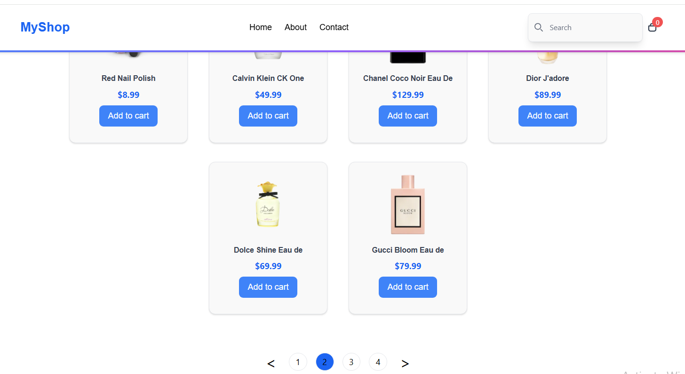
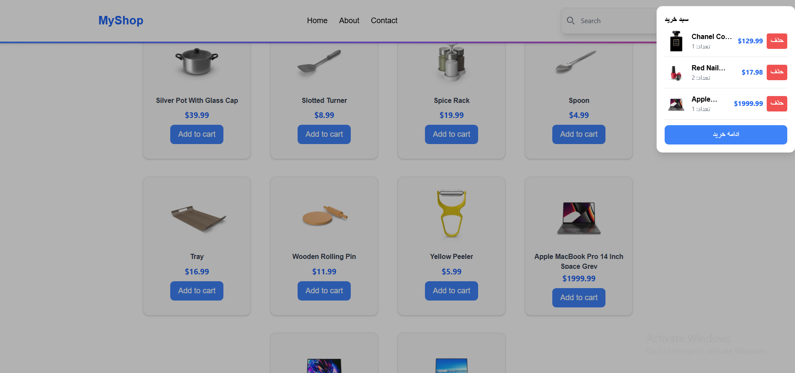
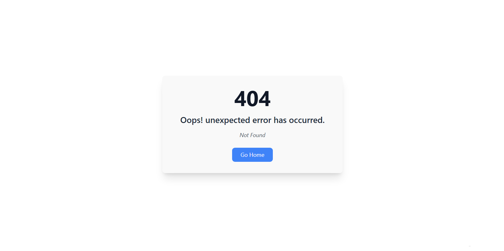

bbb# React Products App

This project is a simple web application for displaying products, managing shopping carts, and searching that uses the DummyJSON site API.

> `https://dummyjson.com/products‍‍‍‍‍‍‍‍‍‍`

---

##### Features:

- Display product list from API
- Pagination
- Product search
- Cart with option to delete and display number of items
- Header includes:
- Navigation links (Home, About, Contact)
- Logo
- Shopping cart icon + number of products
- Error page (`ErrorPage`) for wrong paths and links
- About us page (`About`)
- Contact us page (`Contact`)
- Spinner (loading) when receiving information from the server
- Use `.env` file for API address and sensitive variables

---

### Screenshots

`Home Page`

 

`Pagination`

 

`Cart Page`

 

`404 Page`

### Technologies Used

- React
- Vite
- Axios
- Tailwind CSS
- flowbite
- React Router
- .env

---

### Project Setup

1. Clone the repository
2. Run `npm install`
3. Rename `.env.example` to `.env` and add environment values
4. Run `npm run dev`
